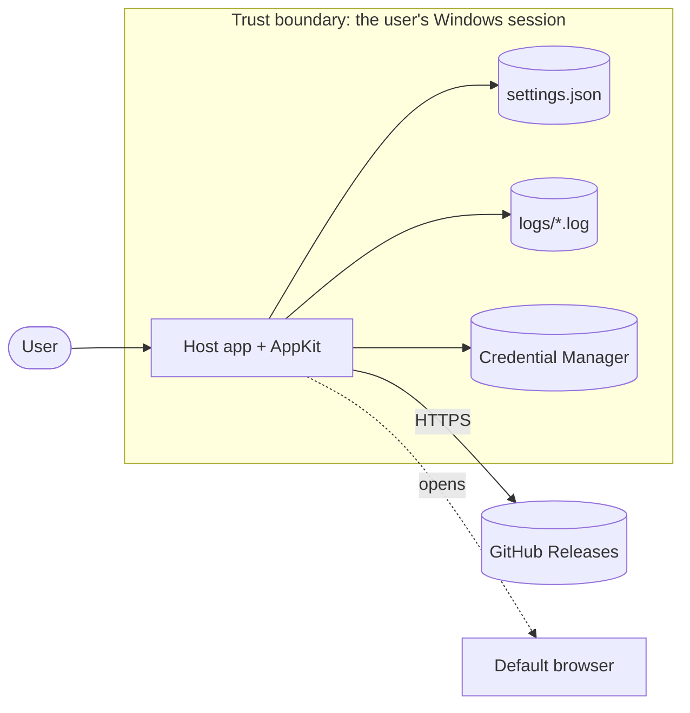

# Threat model: AppKit

AppKit is a set of libraries, so its threats are the ones it creates inside the apps
that use it. This model covers every external interface the four packages open; each
app's own threat model starts from this one ([K22-SDLC-03](https://github.com/KofTwentyTwo/standards/blob/main/policies/sdlc.md#plan-and-design)).

- **Version reviewed:** 0.1.0-dev (before the first release) · **Last reviewed:** 2026-10-09

## 1. What the product is and does

Four NuGet packages that give a KofTwentyTwo Windows desktop app its identity, per-user
data paths, logging, settings, secret storage, splash/About/log-viewer UI, crash net,
theming, and Velopack self-update from the app's GitHub Releases. AppKit runs inside
the host app's process, with the logged-in user's rights; it has no server side and
opens no listening sockets.

## 2. Actors and components

| Actor or component | Description | Trust level |
| --- | --- | --- |
| User | The person running the host app | Trusted for their own data |
| Host app | The application that references AppKit | Trusted (same process) |
| Other local processes of the same user | Can read and write the user's files | Not trusted, but AppKit cannot defend against them |
| GitHub Releases (update feed) | Serves release metadata and Velopack packages over HTTPS | Untrusted network content; integrity checked |
| Velopack | Downloads, verifies, and applies update packages | Trusted dependency |
| Windows Credential Manager | Stores secrets per user, protected by DPAPI | Trusted OS component |

## 3. Data flow and trust boundaries

## 4. External interfaces

| Interface | Direction | Data | Authenticated? | Validated where? |
| --- | --- | --- | --- | --- |
| Update check and download (`VelopackUpdateService`) | In | Release metadata, update packages | HTTPS to github.com; Velopack verifies package hashes from the release feed | Velopack; versions parsed by Velopack |
| `settings.json` (`SettingsStore<T>`) | In and out | User preferences | No (user-writable file) | `ISanitizable.Sanitize` clamps and validates every value on load; a corrupt file yields defaults |
| Log files (`FileActivityLog`) | Out (and in for `LogTail`) | Operational messages | No (user-writable files) | Viewers display text only; nothing is executed or parsed beyond line timestamps (regex with a timeout) |
| Credential Manager (`CredentialManagerVault`) | In and out | Secrets the host app stores (tokens) | Windows logon session (DPAPI) | Keys validated; secrets never logged |
| `<ID>_DATA_DIR` environment variable (`AppPaths`) | In | Data folder path | No | Used as a folder path only |
| Velopack process hooks (`VelopackStartup`) | In | Command-line arguments from the installer/updater | No | Velopack handles them and exits; other arguments pass through untouched |
| Links in the About dialog and log window | Out | Repository URL, log folder path | No | Values come from the host app's `AppInfo`, not from input |

## 5. Assets

- The user's secrets in the Credential Manager (for example GitHub tokens in gclo).
- The integrity of the host app's code: a malicious update would run as the user.
- The user's data and preferences under `%LOCALAPPDATA%\<id>`.
- The availability of the host app (a crash or hang at startup).

## 6. Threats (STRIDE)

| # | Boundary / component | Category | Threat | Likelihood | Impact | Mitigation | Status |
| --- | --- | --- | --- | --- | --- | --- | --- |
| T1 | Update feed | Tampering | An attacker serves a malicious update package | Low | Critical | HTTPS only; Velopack verifies package hashes; releases are immutable and every asset is attested by the shared release workflow (SLSA Build L3); prerelease builds follow only the dev channel | Mitigated |
| T2 | Update feed | Spoofing | A look-alike repository URL is configured | Low | Critical | The feed is the host app's own `AppInfo.RepositoryUrl`, fixed at build time, not user input | Mitigated |
| T3 | Update flow | Denial of service | A failing or slow update check crashes or blocks the app | Medium | Medium | Every update member is guarded and returns errors as values; the check runs after startup | Mitigated |
| T4 | Secrets | Information disclosure | A token leaks through logs, settings, or memory | Medium | High | Secrets only in the Credential Manager; never in settings or logs; the pinned plaintext buffer is cleared after writing | Mitigated |
| T5 | settings.json | Tampering | A crafted settings file sets out-of-range values or crashes parsing | Low | Low | Source-generated JSON parsing inside a catch-all; values sanitized; failure means defaults | Mitigated |
| T6 | Log files | Tampering / denial of service | A huge or crafted log file hangs the log viewer | Low | Low | The viewer retains the last 2,000 lines and the entry regex has a match timeout, but reading still scans the whole file; neither bound limits individual line size | Partially mitigated |
| T7 | UI thread | Denial of service | An exception escaping an async handler kills the app | Medium | Medium | Crash net logs and handles dispatcher exceptions; one-dialog-at-a-time guard prevents the stowed-exception crash | Mitigated |
| T8 | Data folder | Elevation of privilege | `<ID>_DATA_DIR` points the app at another location | Low | Low | The variable is set by the same user; the app gains no rights it did not have | Accepted |
| T9 | Dependencies | Tampering | A compromised package in AppKit's graph | Low | High | Central versions, lock files with locked restore, dependency review, Trivy and OSV-Scanner in CI, Dependabot with a cooldown | Mitigated |
| T10 | Repudiation | Repudiation | Not applicable: AppKit makes no security decisions on behalf of a remote party | n/a | n/a | n/a | n/a |

## 7. Accepted risks

- **T8:** another process running as the same user can redirect or read AppKit's data;
  defending against the user's own processes is outside a desktop library's reach.
- **Unsigned binaries until code signing is available:** apps built on AppKit ship
  without an Authenticode signature until the KofTwentyTwo signing identity is validated
  ([exception EX-0002](https://github.com/KofTwentyTwo/standards/blob/main/exceptions/register.md#ex-0002));
  provenance attestations and checksums remain verifiable.

## 8. Review log

Generated-input regression coverage for T5 and T6 lives in
`tests/KofTwentyTwo.AppKit.Tests/InputProperties.cs`. Four FsCheck properties each
run 500 cases in the normal unit suite, checking repair invariants, arbitrary JSON
and UTF-8 bytes, persistence, and bounded log tails. These bounded tests do not
establish resilience against unlimited-size files or replace native dependency testing.

Repository change controls and their single-maintainer limitation are assessed in
[scorecard.md](scorecard.md). The automated review-record check validates an
acknowledged review of the current PR commit; it does not replace human review.

| Date | Version | Reviewer | Changes |
| --- | --- | --- | --- |
| 2026-10-09 | 0.1.0-dev | James Maes | Initial model |
